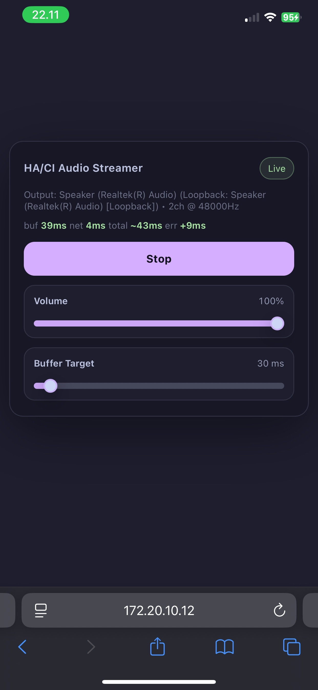
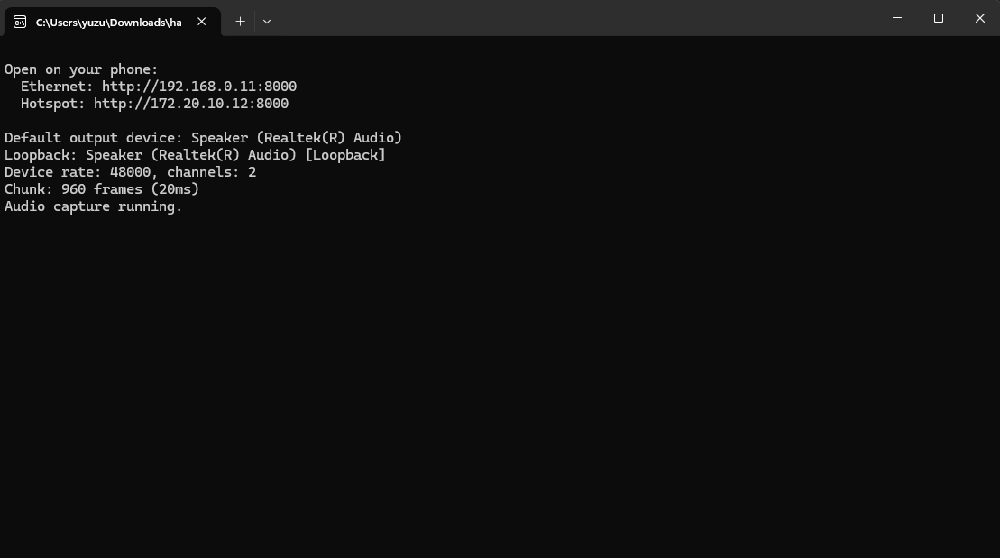

# Hearing Aid Streamer
Stream audio from your PC to hearing aid via iPhone / Android




## How to install
Download the app in [Releases](https://github.com/shorelined/ha-streamer/releases) tab

### Or if you want to run it directly
Install Python and these packages:
```bash
pip install Flask flask-sock
```

Then run:
```bash
python streamer.py
```

Tested on Python 3.12

## Setup
It's recommended to use USB Tethering over Wi-Fi (for low-latency). If you have an iPhone you have to download and connect to [iTunes](https://www.apple.com/itunes/) for USB Tethering to work. 

After connecting your iPhone / Android with USB Tethering, Run the app and open the <IP:Port> from "Hotspot: <IP:Port>" in your phone browser. Or if youre using Wi-Fi just connect to the network youre using (ie. WiFi, Ethernet)

Buffer target is automatically adjusted if you get buffer underruns, so its better to leave it as is. Unless youre using Wi-Fi / Hotspot, in which case you should crank it to 400-500ms depending on your network quality.

### Brief note for iPhone users
If you're having trouble connecting your iPhone with USB Tethering, just enable Tethering while your iPhone is connected. Make sure iTunes is installed and detects your device.
